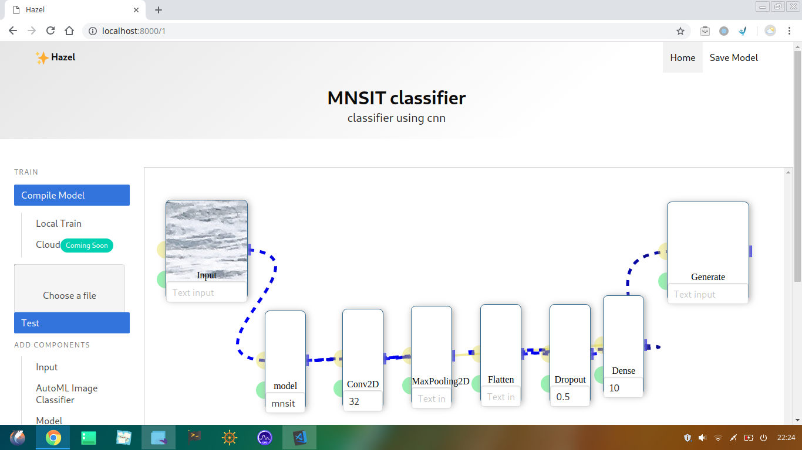

# Hazel

## Easy to use Deep learning models

> Build, train, and ship custom deep learning models using a simple visual interface.
Train and Test models in a single Click.
When you are done ship it as a REST api to your app.
Don't write any code, but still customise the models.

## Why Hazel ?

.jpg)
-2.jpg)
-3.jpg)
-4.jpg)
-5.jpg)
-6.jpg)