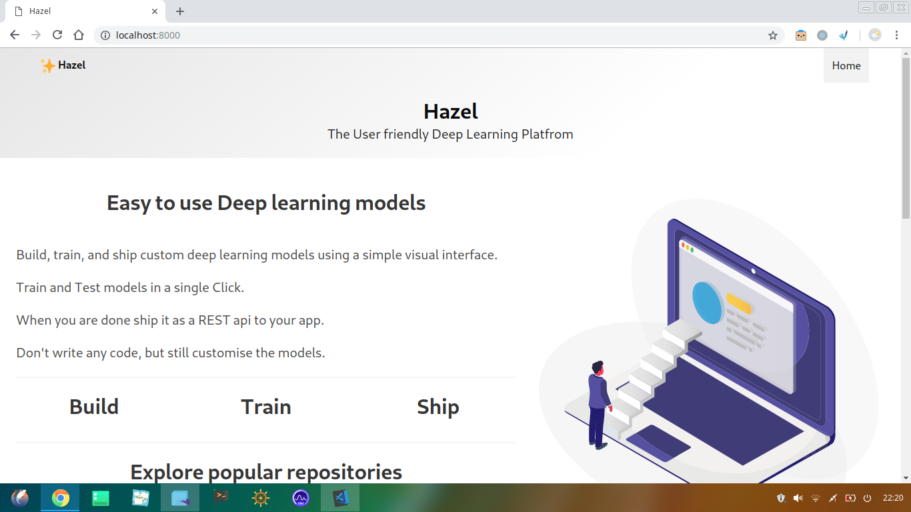
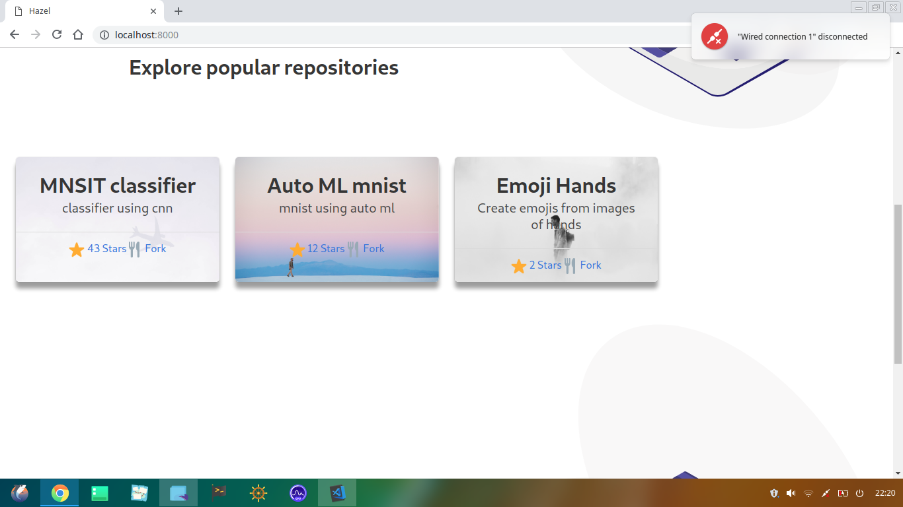

# Hazel

## Easy to use Deep learning models

> Build, train, and ship custom deep learning models using a simple visual interface.
Train and Test models in a single Click.
When you are done ship it as a REST api to your app.
Don't write any code, but still customise the models.

